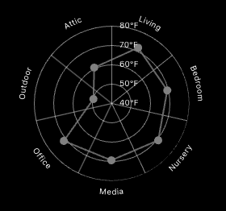

# MMM-TemperatureRadar

A MagicMirror² module that displays temperature readings from multiple rooms in a radar chart. Integrates with Home Assistant to show real-time temperature data, or can display demo data if Home Assistant is not configured.

## Screenshot


## Installation

1. Navigate to your MagicMirror's `modules` directory:
```bash
cd ~/MagicMirror/modules
```
2. Clone this repository:
```bash
git clone https://github.com/yourusername/MMM-TemperatureRadar.git
```

3. Install dependencies:
```bash
cd MMM-TemperatureRadar
npm install
```

## Configuration
Add the following configuration to your config/config.js file:
```javascript
{
    module: "MMM-TemperatureRadar",
    position: "top_right",
    config: {
        haUrl: "http://your-home-assistant-url:8123",
        haToken: "your_long_lived_access_token",
        width: "300px",
        height: "300px",
        entities: [
            { room: "Living Room", entity_id: "sensor.living_room_temperature" },
            { room: "Kitchen", entity_id: "sensor.kitchen_temperature" },
            { room: "Bedroom", entity_id: "sensor.bedroom_temperature" },
            // Add more rooms as needed
        ]
    }
}
```

### Configuration Options

| Option | Description | 
|--------|-------------| 
| haUrl | Your Home Assistant URL. Leave empty to use demo data. | 
| haToken | Your Home Assistant long-lived access token. Required if using Home Assistant. | 
| width | Width of the chart. Default: "100px" | 
| height | Height of the chart. Default: "100px" | 
| updateInterval | How often to update the data (in milliseconds). Default: 300000 (5 minutes) | 
| entities | Array of objects containing room names and their corresponding Home Assistant entity IDs |

### Home Assistant Setup
1. In Home Assistant, go to your profile
2. Scroll to the bottom and create a Long-Lived Access Token
3. Copy this token to the haToken field in your configuration
4. Make sure your entity IDs match those in your Home Assistant instance

## Updating
To update the module to the latest version:

```
cd ~/MagicMirror/modules/MMM-TemperatureRadar
git pull
npm install
```

## Contributing
If you find any bugs or would like to contribute to the module, please create an issue or submit a pull request on GitHub.

## License
This project is licensed under the MIT License - see the LICENSE file for details.
